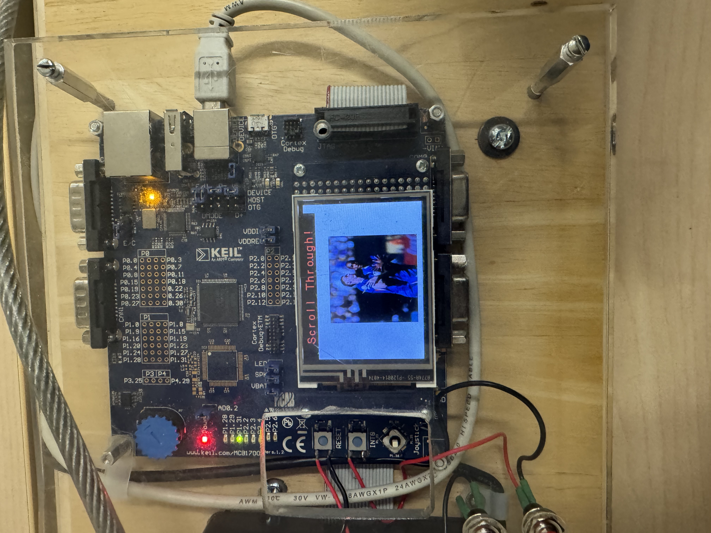
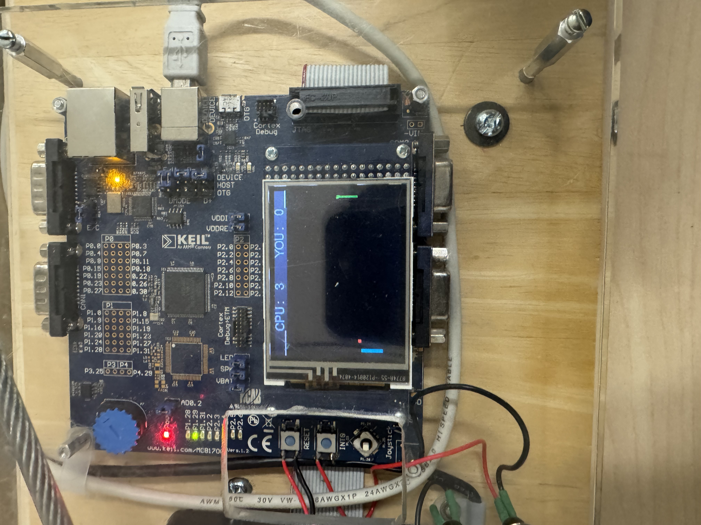
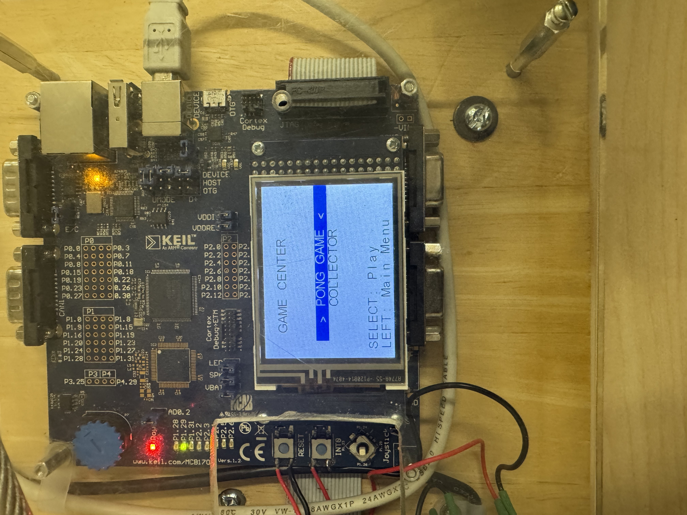
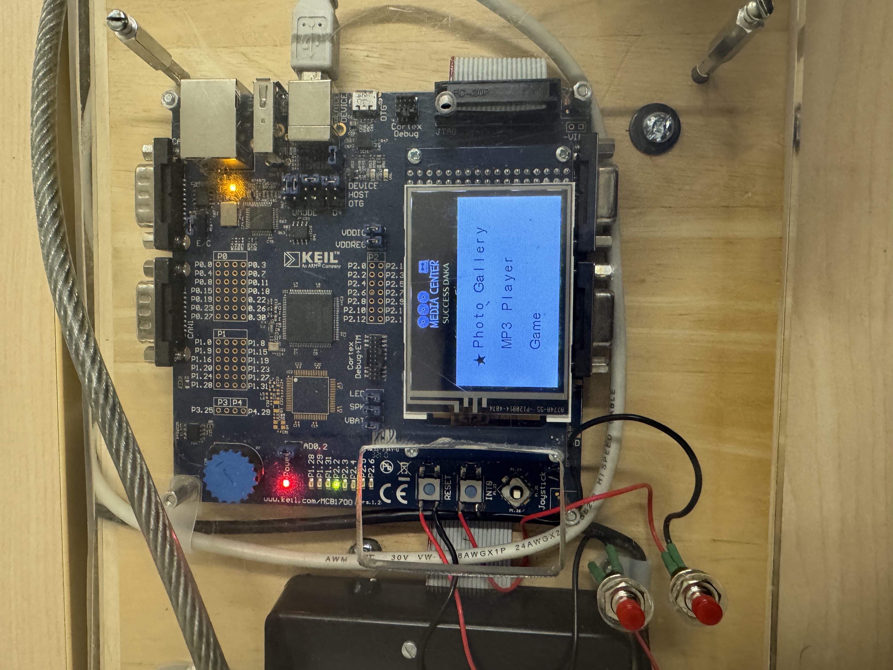

# ARM Cortex-M3 Media Center

An embedded multimedia system developed for the NXP LPC1768 ARM Cortex-M3 microcontroller featuring photo gallery, USB audio streaming, and an interactive game center with real-time graphics rendering.


## Project Demo

### Photo Gallery

*Photo gallery displaying images with joystick navigation*


### Pong Game

*Multi-ball Pong with AI opponent and score tracking*

### Game Center Menu

*Game selection interface with Pong and Collector options*

### Main Menu 


## Features

**Photo Gallery**
- Display bitmap images on 320×240 GLCD
- Navigate through images using joystick controls
- RGB565 color format support

**MP3 Player**
- USB audio streaming from PC
- Real-time volume control via potentiometer
- Visual playback interface with connection status

**Game Center**
- **Pong**: Multi-ball physics simulation with AI opponent, paddle spin mechanics, and dynamic difficulty
- **Coin Collector**: Lane-based arcade game with falling objects, score tracking, and lives system

**Navigation**
- Intuitive menu system with star icon selection indicator
- 5-way joystick control
- LED bar graph feedback

## Running it Yourself

### Prerequisites
- **Hardware**: MCB1700 development board (LPC1768 microcontroller)
- **Software**: Keil µVision 5 IDE

### Installation

1. Clone the repository:
```bash
git clone https://github.com/sdaka21/ARM-Cortex-M3-Media-Center.git
```

2. Open the project in Keil µVision 5 IDE
3. Configure target settings:
   - Ensure Flash initialization is enabled
   - Verify scatter file configuration
4. Compile and upload to the MCB1700 board

*If the code does not compile in µVision, ensure all source files are properly added to the project targets and Flash initialization is enabled in target settings

### Usage

- Use the **joystick** to navigate the main menu
- Select **Photo Gallery** to view images
- Select **MP3 Player** to stream audio (requires USB connection to PC)
- Select **Game Center** to play Pong or Coin Collector
  - In Pong: Use joystick up/down to control paddle
  - In Coin Collector: Use joystick left/right to move between lanes

## Files

The main game logic lies in `game.c` and `game.h`.  
Menu navigation is handled in `Menu.c`.  
LCD graphics rendering uses `GLCD_SPI_LPC1700.c`.

## Media Center Components

The game center is part of a general media center that includes:
- **Photo Gallery**: View and browse bitmap images stored on the device
- **MP3 Player**: Use the board as a USB speaker with volume control
- **Game Center**: Play interactive arcade games with real-time graphics

## Technical Details

- **Processor**: ARM Cortex-M3 (LPC1768) @ 100 MHz
- **Display**: 320×240 pixel color GLCD
- **Memory**: 512 KB Flash, 64 KB SRAM
- **Input**: 5-way joystick, potentiometer
- **RTOS**: RTX for task scheduling
- **Timing**: Interrupt-driven SysTick configuration

---
